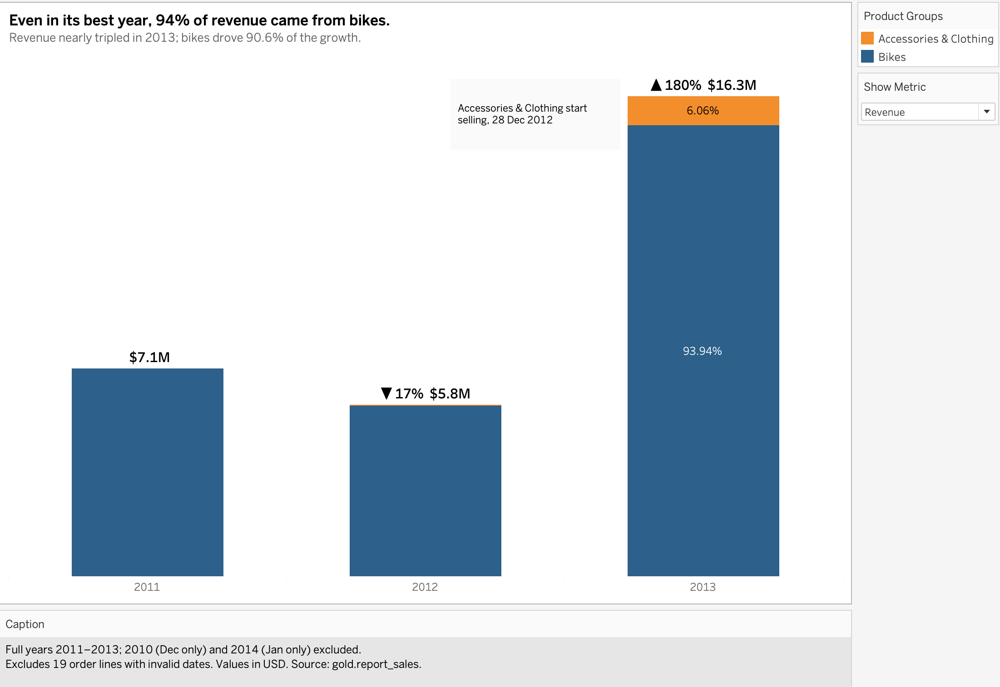
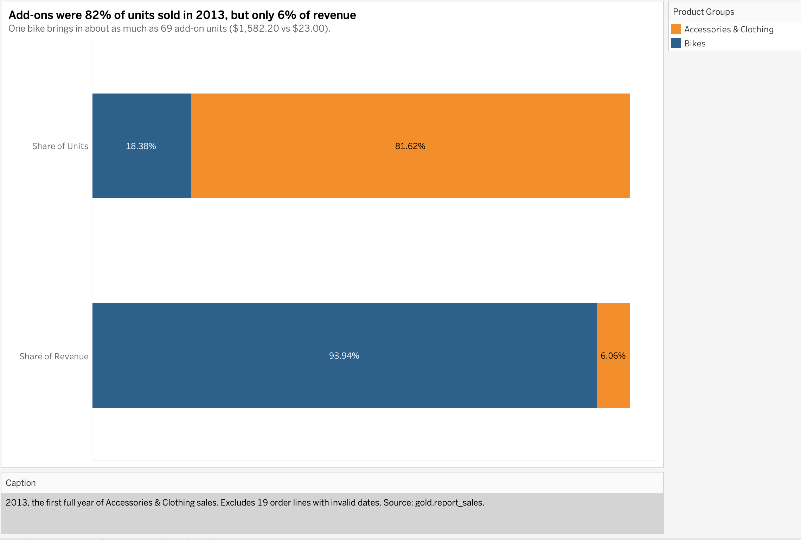
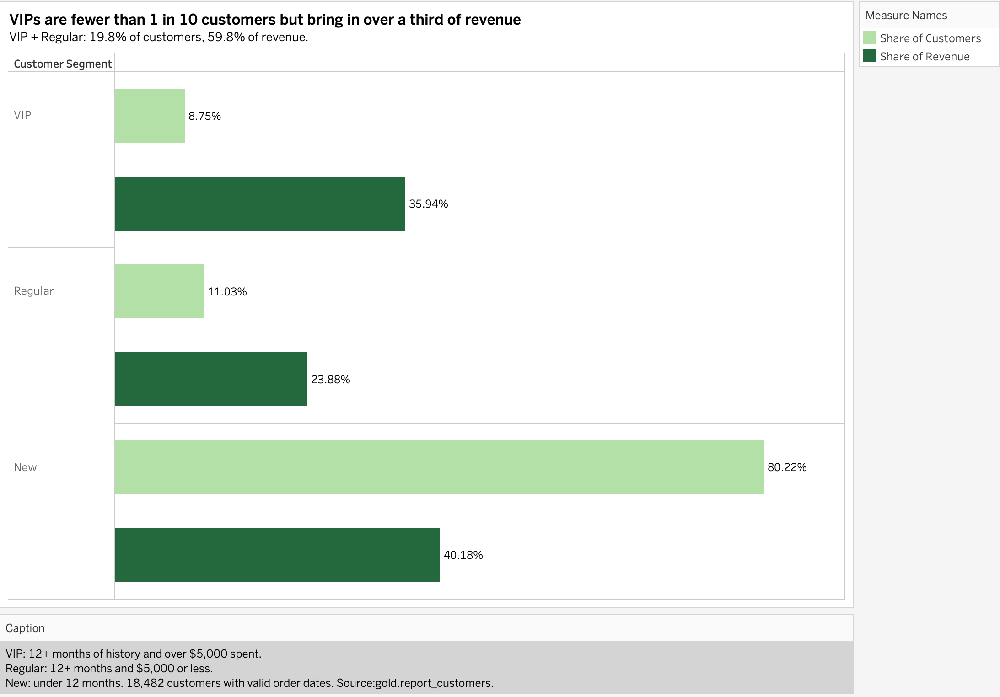
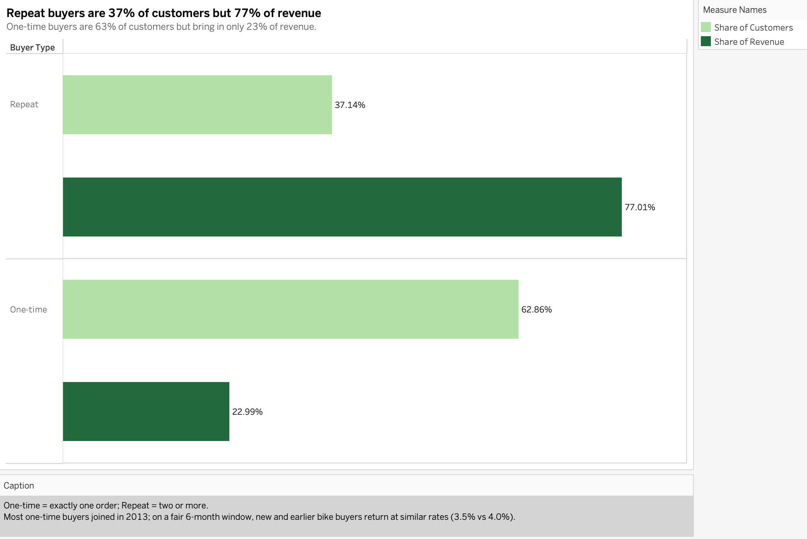
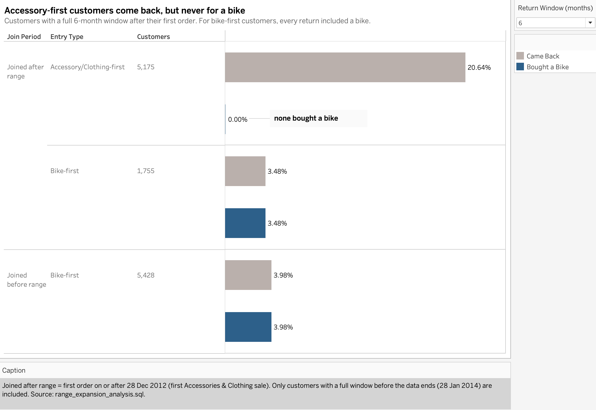
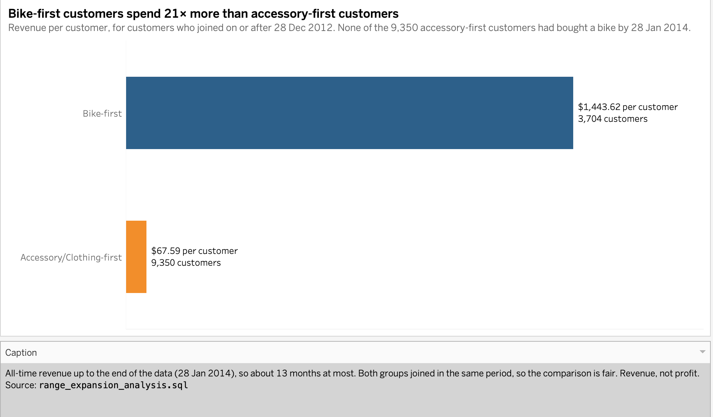
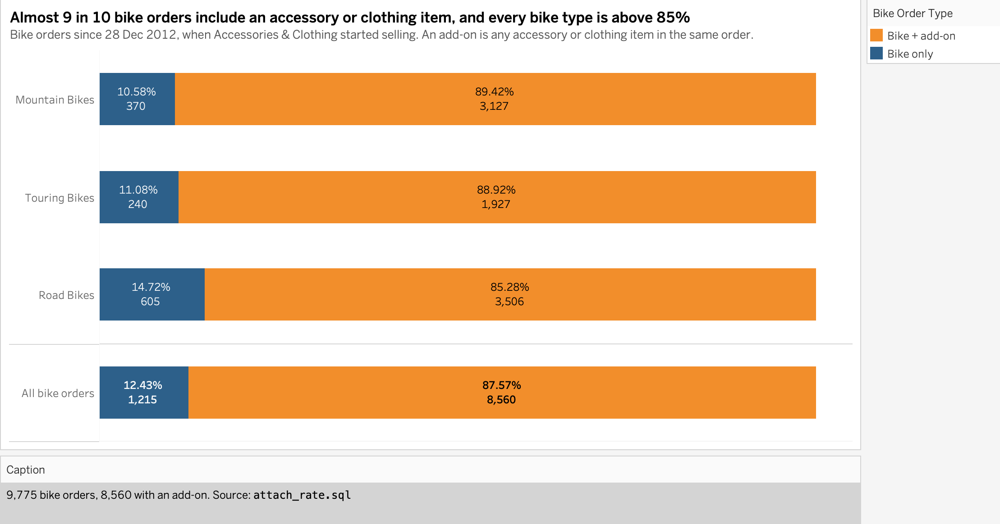
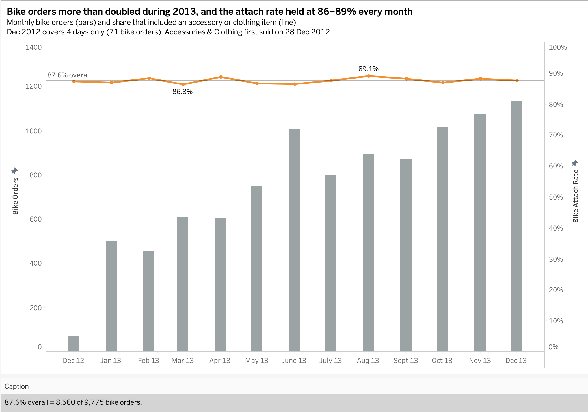
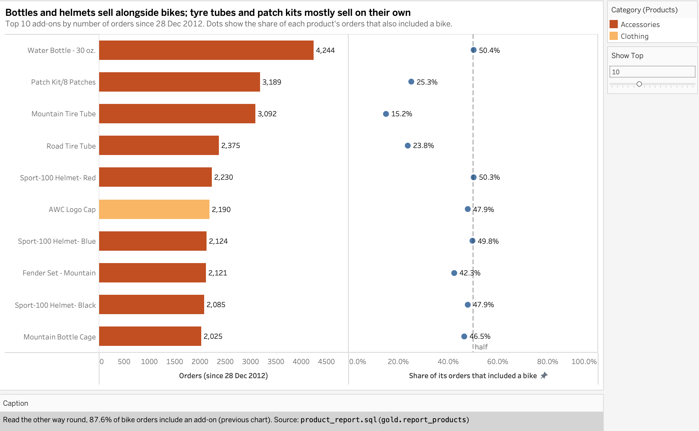
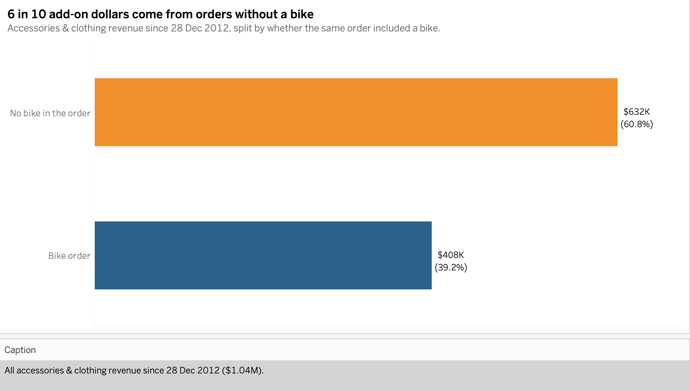

# Adventure Works Cycles: Product Range & Customer Retention Analysis

*Did a new accessories range bring in future bike buyers? An end-to-end project from raw data to a PostgreSQL warehouse, SQL analysis, Tableau dashboards and recommendations.*

---

## Background and Overview

Adventure Works Cycles is a bicycle manufacturer selling directly to consumers in several countries. Until late December 2012 its customers bought only high-value Road, Mountain and Touring bikes. From **28 December 2012**, a lower-priced range of **Accessories and Clothing** began appearing in customer orders.

**Stakeholder:** Director of Sales & Marketing, who decides which products to invest in and how to spend the customer acquisition and retention budget.

**The decision:** should the business keep growing the Accessories & Clothing range to attract new customers, or focus on keeping and growing its loyal, high-spending bike buyers?

**Why it matters:** bikes generate **96.46%** of revenue, so the business is heavily exposed if bike demand slows. At the same time, **62.86%** of customers have bought only once, while fewer than 1 in 10 customers (VIPs) bring in over a third of revenue (**35.94%**). Investing in the wrong area means spending money on customers who won't return while the core business stays at risk.

**Questions this project answers**
1. **How dependent are we on bikes?** Is the rest of the range growing enough to reduce that risk?
2. **Who are our most valuable customers?** How do loyal, high-spending customers compare with new ones?
3. **Did adding Accessories & Clothing work?** Did it bring in customers who went on to buy a bike?
4. **Do bike buyers also buy accessories?** Is the range more valuable as an add-on than as a way in?

> **Note on timing:** Accessories and Clothing exist in the product catalogue from 2011–2012, but their first recorded sale is 28 Dec 2012. This analysis uses that date as the start of the range's sales and makes no claim about why sales began then. The data ends on 28 Jan 2014, so customers who arrived with the range have had at most about 13 months to return.

---

## Executive Summary

**Headline numbers**

| Total revenue | Orders | Customers who purchased | Average order value | Items sold | Products sold |
|---|---|---|---|---|---|
| $29,356,250 | 27,659 | 18,482 | $1,061.36 | 60,423 | 130 of 295 |

**Key findings**
- **Bikes carry the business.** Bikes are **96.46%** of revenue, and they drove **90.6%** of the 2013 revenue growth. In 2013, the range's first full year, add-ons were 81.6% of units sold but only **6.06%** of revenue.
- **A small group of loyal customers earns most of the money.** VIPs are **8.75%** of customers but **35.94%** of revenue; repeat buyers are 37.14% of customers but **77.01%** of revenue.
- **The new range did not create bike buyers.** **None of the 9,350** customers whose first purchase was an accessory or clothing item went on to buy a bike. They spent **$67.59** each on average, against **$1,443.62** for bike-first customers who joined in the same period.
- **It works well as an add-on.** **87.6%** of bike orders include an accessory or clothing item, adding **$47.62** per order, and the rate held at 86–89% every month of 2013 while bike orders more than doubled.

**Recommendation:** **Stop treating Accessories & Clothing as a way to win new customers. Invest in keeping bike buyers and in selling add-ons at the point of the bike purchase.**

---

## Insights

*Explore every chart below interactively on [Tableau Public](https://public.tableau.com/views/adventure-works-range-retention-analysis/Revenue).*

### 1. Bikes carry the business, and even the 2013 growth came from bikes

Bikes generated **96.46%** of the **$29.36M** total revenue (Accessories 2.39%, Clothing 1.16%). Until late December 2012, bikes were the only products customers bought.

Revenue nearly tripled in 2013 (+$10.5M), and **bikes drove 90.6% of that growth**. The business sold almost three times as many bikes (+196.8%) at a lower average price. The new range has not changed the picture: in 2013 add-ons made up **81.6% of units sold but only 6.06% of revenue**, because a bike earned $1,582.20 per unit against $23.00 for an add-on.

**This is a price gap rather than a demand problem. Even strong add-on sales barely move the revenue mix, so the business and its growth still depend on bike volume, and the bike customer base is the asset to protect.**

<table>
  <tr>
    <td width="50%"></td>
    <td width="50%"></td>
  </tr>
</table>

See the numbers

| Year | Revenue | Change | Add-on revenue | Bike share |
|---|---|---|---|---|
| 2011 | $7,075,088 | – | $0 | 100.00% |
| 2012 | $5,842,231 | ▼ 17.4% | $2,788 | 99.95% |
| 2013 | $16,344,878 | ▲ 179.8% | $991,171 | **93.94%** |

| Year | Bike units | Revenue per bike | Add-on units | Revenue per add-on unit |
|---|---|---|---|---|
| 2011 | 2,216 | $3,192.73 | – | – |
| 2012 | 3,269 | $1,786.31 | 128 | $21.78 |
| 2013 | 9,704 | $1,582.20 | 43,103 | $23.00 |

- 2013 growth: +$10,502,647 in total, of which bikes +$9,514,264 (90.6%) and add-ons +$988,383 (9.4%).
- In 2012, revenue fell 17.4% even though bike units rose 47.5%, because revenue per bike fell 44.1%.
- Full years only; 2010 (Dec only) and 2014 (Jan only) are excluded.

*Source: `part_to_whole_analysis.sql`*

### 2. Lose a VIP and you lose the revenue of about 8 new customers

Revenue is concentrated in a small, loyal group. **VIP customers** (12+ months of history and over $5,000 spent) are **8.75%** of customers but bring in **35.94%** of revenue, about $6,524 each. New customers are 80.22% of the base but earn 40.18% of revenue, about $796 each. Each VIP is worth about 8 new customers.

The same pattern shows in buying behaviour: the **37.14%** of customers who ordered more than once generate **77.01%** of revenue, while the 62.86% who have bought only once bring in the rest.

The high one-time rate most likely reflects how recently most customers joined, not falling loyalty. Measured over the same 6 months, bike buyers who joined after the range came back at about the same rate as earlier bike buyers (**3.5% vs 4.0%**). **Keeping customers, and giving them reasons to come back between bike purchases, is worth far more than winning new one-off buyers.**

<table>
  <tr>
    <td width="50%"></td>
    <td width="50%"></td>
  </tr>
</table>

See the numbers

| Segment | Customers | % of customers | Revenue | % of revenue | Revenue per customer |
|---|---|---|---|---|---|
| New | 14,826 | 80.22% | $11,794,065 | 40.18% | $795.50 |
| Regular | 2,039 | 11.03% | $7,008,044 | 23.88% | $3,437.00 |
| VIP | 1,617 | 8.75% | $10,549,149 | 35.94% | $6,523.90 |

| Buyer type | Customers | % of customers | Revenue | % of revenue |
|---|---|---|---|---|
| Repeat | 6,865 | 37.14% | $22,604,546 | 77.01% |
| One-time | 11,617 | 62.86% | $6,746,712 | 22.99% |

*Sources: `data_segmentation.sql`, `range_expansion_analysis.sql`*

### 3. The new range brought in customers, but not bike buyers

Since Accessories & Clothing started selling, **9,350** customers made an accessory or clothing item their first purchase. In this dataset, **none of them went on to buy a bike**. About 1 in 5 (19.9%) came back, only to buy more accessories.

Comparing every customer over the same 6 months after their first order, the pattern holds: **20.6%** of accessory-first customers came back and **0%** bought a bike. Bike buyers who came back almost always did so for another bike. The two groups behave as separate markets:**the range most likely attracts people buying gear rather than future bike buyers.**

The value gap is large. An accessory-first customer spent **$67.59** on average; a bike-first customer who joined in the same period spent **$1,443.62**, about **21× more**.

<table>
  <tr>
    <td width="50%"></td>
    <td width="50%"></td>
  </tr>
</table>

*A perfect 0% may partly reflect how the AdventureWorks sample data was generated, so it is a finding about this dataset rather than a rule of customer behaviour.*

See the numbers

**All time (to 28 Jan 2014)**

| Join period | Entry type | Customers | Later bought a bike | Came back for anything | Revenue per customer |
|---|---|---|---|---|---|
| Joined after range | Accessory/Clothing-first | 9,350 | 0.0% | 19.9% | $67.59 |
| Joined after range | Bike-first | 3,704 | 2.2% | 2.2% | $1,443.62 |
| Joined before range | Bike-first | 5,428 | 90.7% | 90.7% | $4,305.86 |

**Fair comparison: 6-month window (customers with a full 6 months of data)**

| Join period | Entry type | Customers | Came back within 6 months | Bought a bike within 6 months |
|---|---|---|---|---|
| Joined after range | Accessory/Clothing-first | 5,175 | 20.6% | **0.0%** |
| Joined after range | Bike-first | 1,755 | 3.5% | 3.5% |
| Joined before range | Bike-first | 5,428 | 4.0% | 4.0% |

**3-month window:** accessory-first 11.1% came back and 0.0% bought a bike (7,446 customers); bike-first after range 0.5% (2,708); bike-first before range 0.9% (5,428).

- The all-time figures aren't like-for-like: customers who joined before the range had up to about 37 months to return, later customers at most about 13. That is why the fixed-window comparison is the fair test, and why customers who joined before the range are left out of the revenue-per-customer chart.
- Revenue per customer is revenue, not profit.

*Source: `range_expansion_analysis.sql` (`window_months` = 6 or 3)*

### 4. Accessories and Clothing work as an add-on to bike sales

Where the range does work is alongside a bike. **87.6%** of bike orders since 28 Dec 2012 (8,560 of 9,775) include an accessory or clothing item, adding **$47.62** per order on average. The rate is above 85% for every bike type, and it stayed between **86% and 89% every month of 2013**, even as monthly bike orders more than doubled (497 in January to 1,135 in December).

Read the other way round, the picture is different. Even the most popular add-on, the Water Bottle – 30 oz. (4,244 orders), is bought with a bike only **50.4%** of the time. Helmets, bottles and cages sell alongside bikes about half the time, while tyre tubes and patch kits mostly sell on their own (15–25% with a bike), most likely as replacements. Overall, **60.8%** of add-on revenue ($631,981) comes from orders without a bike.

Bike buyers kit out a new bike at the point of purchase, but almost never come back for accessories later: only $60 of their add-on spend happened outside a bike order. The range adds value by **raising the value of each bike sale**, not by bringing in future bike buyers, and at about $1.04M in total it remains small next to $28.3M from bikes.

<table>
  <tr>
    <td width="50%"></td>
    <td width="50%"></td>
  </tr>
</table>

<table>
  <tr>
    <td width="50%"></td>
    <td width="50%"></td>
  </tr>
</table>

See the numbers

| Measure | Value |
|---|---|
| Bike orders since 28 Dec 2012 | 9,775 |
| Bike orders with an add-on | 8,560 (87.6%) |
| Add-on revenue per bike order | $47.62 |
| Add-on revenue in orders without a bike | $631,981 (60.8%) |
| Add-on revenue in orders with a bike | $407,620 (39.2%) |
| Customers who never bought a bike: add-on revenue | 9,350 customers, $631,921 ($67.59 each) |
| Bike buyers: add-on revenue | 7,676 customers, $407,680 ($53.11 each) |

| Month | Bike orders | With an add-on | Attach rate |
|---|---|---|---|
| Dec 2012 (from 28 Dec) | 71 | 62 | 87.3% |
| Jan 2013 | 497 | 432 | 86.9% |
| Feb 2013 | 454 | 401 | 88.3% |
| Mar 2013 | 608 | 525 | 86.3% |
| Apr 2013 | 604 | 536 | 88.7% |
| May 2013 | 749 | 649 | 86.6% |
| Jun 2013 | 1,004 | 868 | 86.5% |
| Jul 2013 | 797 | 698 | 87.6% |
| Aug 2013 | 895 | 797 | 89.1% |
| Sep 2013 | 870 | 767 | 88.2% |
| Oct 2013 | 1,016 | 883 | 86.9% |
| Nov 2013 | 1,075 | 948 | 88.2% |
| Dec 2013 | 1,135 | 994 | 87.6% |

No bikes were sold in Jan 2014 (data ends 28 Jan 2014).

- **Two directions of the same link:** 87.6% of *bike orders* include an add-on, while about half of *add-on orders* include a bike.
- 165 of the 295 catalogue products never sold, including **15 of 35 Clothing products (43%)**.

*Sources: `attach_rate.sql`, `product_report.sql` (`gold.report_products`), `magnitude_analysis.sql`*

> **Overall:** the range works as an add-on, not as a way in. Bike buyers add accessories to almost every order, but accessory buyers never go on to buy bikes.

---

## Recommendations

Expected impact is described qualitatively; no query estimated future results.

**CRM & Retention**
1. **(P0) Run a retention programme for VIP and Regular bike buyers**, such as loyalty offers and service reminders. They bring in most of the revenue. *Metric to watch:* 6-Month Repeat Rate; loyal customer revenue share (baseline 59.82%).
2. **(P1) Test follow-up accessory offers for existing bike owners.** Bike buyers rarely return for accessories today, so this is a hypothesis to test, not a proven gain. *Metric to watch:* add-on revenue from bike buyers outside bike orders.

**E-commerce & Merchandising**

3. **(P0) Bundle and suggest add-ons at bike checkout.** This builds on existing behaviour (87.6% attach) to raise the value of each bike order. *Metric to watch:* Bike Attach Rate (baseline 87.6%); add-on revenue per bike order (baseline $47.62).
4. **(P2) Review the Clothing range.** 43% of Clothing products never sold. *Metric to watch:* Clothing products with at least one sale.

**Acquisition**

5. **(P1) Shift acquisition spend away from accessory-led campaigns and towards bike buyers.** Accessory-first customers spend about $68 each and, in this data, never went on to buy a bike. *Metric to watch:* Accessory-to-Bike Conversion within 6 months (baseline 0%).

---

## Appendix: Technical Details

### A. Metric definitions

**North Star metrics:** each one measures the outcome of one side of the decision.

| Metric | Business definition | Baseline | Source script |
|---|---|---|---|
| **Bike Revenue Share** | % of total revenue that comes from bikes | **96.46%** overall; **93.94%** in 2013 | `part_to_whole_analysis.sql` |
| **6-Month Repeat Rate** | % of customers who ordered again within 6 months of their first order (only customers with a full 6 months of data) | After range, accessory-first **20.6%** · after range, bike-first **3.5%** · before range, bike-first **4.0%** | `range_expansion_analysis.sql` |
| **Accessory-to-Bike Conversion** | % of accessory/clothing-first customers who later bought a bike | **0.0%** (0 of 9,350); 0.0% within 6 months (0 of 5,175) | `range_expansion_analysis.sql` |
| **Bike Attach Rate** | % of orders containing a bike that also contain an accessory or clothing item | **87.6%** (8,560 of 9,775), adding **$47.62** per order | `attach_rate.sql` |

**Supporting metrics**

| Metric | Baseline | Source script |
|---|---|---|
| Loyal customer revenue share | VIP: **8.75%** of customers → **35.94%** of revenue · VIP + Regular: **19.78%** → **59.82%** | `data_segmentation.sql` |
| One-time buyer rate (all time) | **62.86%** (11,617 of 18,482) | `data_segmentation.sql` |

**Definitions**
- **VIP:** at least 12 months of purchase history and total spend over $5,000
- **Regular:** at least 12 months of history and total spend of $5,000 or less
- **New:** less than 12 months of purchase history
- **One-time / Repeat buyer:** exactly one order / two or more orders
- **Bike-first / Accessory-Clothing-first:** whether a bike was bought on the customer's first purchase day
- **Joined before / after range:** first order before / on or after 28 Dec 2012
- **Add-on:** any Accessories or Clothing item

**Calculation rules**
- Revenue totals include every order line. Customer-level and time-based metrics exclude the 19 order lines with invalid (NULL) order dates ($4,992), so customer-level revenue totals $29,351,258.
- Ages and recency are measured from the last order date in the data (28 Jan 2014), not today's date.

| Question | Answered by |
|---|---|
| Q1 | `part_to_whole_analysis.sql`, `magnitude_analysis.sql`, `performance_analysis.sql` |
| Q2 | `data_segmentation.sql`, `customer_report.sql` |
| Q3 | `range_expansion_analysis.sql` |
| Q4 | `attach_rate.sql`, `product_report.sql` |

### B. Assumptions and caveats

**Assumptions**
- **Range start date:** Accessories & Clothing are treated as starting on **28 Dec 2012**, their first recorded sale. They appear in the catalogue earlier, so this is not called a launch.
- **Currency:** all amounts are in US dollars (USD), the base currency of the AdventureWorks sample data.
- **"Today":** recency, age and time windows are measured from the last order date (**28 Jan 2014**), not the current date.
- **Entry type:** a customer is bike-first if a bike was bought on their first purchase day, and accessory/clothing-first otherwise.
- **Segment thresholds:** VIP and Regular need at least 12 months of purchase history, split at $5,000 total spend. These are analyst choices, not company definitions.
- **Revenue, not profit:** product cost is not used, so no figure describes margin or profit.

**Caveats**
- **Limited time after the range:** the data ends 13 months after the range started, so post-range customers had less time to return than earlier ones (about 13 vs up to 37 months). The 6-month window is the fair comparison, and post-range results are early signals.
- **Sample data, not real company records:** AdventureWorks is a sample dataset created by Microsoft for practice, not real sales. The results are accurate for this data, but real customers rarely behave so neatly; for example, a real business would be unlikely to see exactly 0 of 9,350 accessory-first customers go on to buy a bike.
- **Interpretations, not proven causes:** explanations such as bike buyers kitting out a new bike or tyre tubes being bought as replacements are readings of the patterns, not tested causes.

### C. Data warehouse architecture

| Layer | Object type | Load | What happens |
|---|---|---|---|
| **Bronze** | Tables | Truncate & insert (`bronze.load_bronze`) | Raw CSVs loaded as-is |
| **Silver** | Tables | Truncate & insert (`silver.load_silver`) | Cleaning, standardisation, deduplication, derived columns |
| **Gold** | Views | None | Star schema for reporting: `dim_customers`, `dim_products`, `fact_sales` |

**Data flow**

**Source integration**

**Star schema**

Full column definitions: [`docs/data_catalog.md`](docs/data_catalog.md)

### D. Data sources

| System | File | Rows | Contents |
|---|---|---|---|
| CRM | `cust_info.csv` | 18,493 | Customer names, marital status, gender, create date |
| CRM | `prd_info.csv` | 396 | Products, cost, product line, validity dates |
| CRM | `sales_details.csv` | 60,398 | Order lines: dates, sales, quantity, price |
| ERP | `CUST_AZ12.csv` | 18,483 | Customer birth date and gender |
| ERP | `LOC_A101.csv` | 18,484 | Customer country |
| ERP | `PX_CAT_G1V2.csv` | 36 | Product category, subcategory, maintenance flag |

Row counts are raw file rows, excluding the header.

### E. Data quality and cleaning

| Issue found | Fix applied (silver layer) |
|---|---|
| Duplicate customer records | Kept latest record per `cst_id` using `ROW_NUMBER()` |
| Leading/trailing spaces in names | `TRIM()` |
| Coded values (`M`, `S`, `F`, `R`…) | Mapped to readable labels |
| Invalid integer dates (0 or wrong length) | Set to `NULL`; valid ones cast to `DATE` |
| Missing, negative or inconsistent sales | Recalculated as `quantity × ABS(price)` |
| Missing or invalid price | Derived as `sales / quantity` |
| Future birth dates | Set to `NULL` |
| Inconsistent country codes (`US`, `USA`, `DE`) | Standardised to full names |
| Missing product end dates | Derived with `LEAD(start_date) − 1 day` |

**Known limitations**
- Customer `create_date` values fall in Oct 2025–Jan 2026, after all orders (2010–2014), so they are not used for tenure analysis.
- Gold surrogate keys are generated with `ROW_NUMBER()` and can change if source data changes.
- `dim_products` holds current products only, so sales of historical product versions may have a null `product_key`.
- All monetary values are in US dollars (USD), the base currency of Microsoft's AdventureWorks sample data. Source amounts are whole dollars.
- 19 order lines ($4,992 in sales) have invalid order dates. They are included in revenue totals but excluded from customer-level and time-based metrics.
- 2010 (from 29 Dec) and 2014 (to 28 Jan) are partial years, so year-on-year changes involving them should be read with caution.
- 7 pedal products have category ID `CO_PE`, which has no match in the ERP category file, so their category is NULL. None were sold.
- 165 of the 295 catalogue products were never sold (127 Components, the 7 uncategorised pedals, 9 Bikes, 15 Clothing and 7 Accessories), so `product_key` values in the report views have gaps.
- Product line `S` is mapped to `other Sales` (lower-case "o") in the silver layer; it is relabelled in Tableau.
- Birth dates range from 1916 to 1986 (customers aged 27–97 at the end of the data).

Quality checks: [`tests/quality_checks_silver.sql`](tests/quality_checks_silver.sql), [`tests/quality_checks_gold.sql`](tests/quality_checks_gold.sql)

## Acknowledgements

Dataset derived from Microsoft's AdventureWorks sample database. 

## About Me

**Manaswini Doma**

[https://www.linkedin.com/in/domamanaswini/](https://www.linkedin.com/in/domamanaswini/) · 
[domamanaswini@gmail.com](mailto:domamanaswini@gmail.com)
